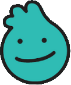

# OSI - Chatbot de l'Offre de Services Informatique


Ce projet est une application **Next.js** proposant un chatbot interactif destiné à l'offre de services informatique de l'Administration Centrale.

## 🚀 Fonctionnalités

- 💬 **Interface de chat interactive** avec **OSI**, l'assistant virtuel.
- 🌙 **Mode sombre/clair** pour un meilleur confort visuel.
- 📱 **Interface responsive** (mobile et desktop).
- 🎬 **Animations fluides** pour une expérience utilisateur améliorée.
- ⭐ **Évaluation des réponses** du chatbot.
- 🖼️ **Affichage de messages, images et vidéos**.
- 🔘 **Boutons interactifs** facilitant la navigation.

## 🛠️ Technologies utilisées

- [Next.js](https://nextjs.org/) - Framework React pour des applications performantes.
- [Tailwind CSS](https://tailwindcss.com/) - Framework CSS utilitaire.
- [Framer Motion](https://www.framer.com/motion/) - Bibliothèque d'animations.
- [React Markdown](https://github.com/remarkjs/react-markdown) - Rendu Markdown.
- [Material-UI Icons](https://mui.com/material-ui/material-icons/) - Icônes pour l'interface utilisateur.

---

## ⚙️ Installation et démarrage

### 📌 Prérequis

- **Node.js** (version 14 ou supérieure)
- **npm**, **yarn**, **pnpm** ou **bun**

### 📥 Installation

1. **Clonez le dépôt** :
   ```sh
   git clone <url-du-repo>
   cd <nom-du-repo>
   ```

2. **Installez les dépendances** :
   ```sh
   npm install
   ```
   ou
   ```sh
   yarn install
   ```

3. **Créez un fichier `.env.local`** à la racine du projet avec les variables suivantes :
   ```sh
   NEXT_PUBLIC_API_OSI=<url-de-votre-api>
   NEXT_PUBLIC_API_TOKEN_OSI=<votre-token-api>
   ```

4. **Lancez le serveur de développement** :
   ```sh
   npm run dev
   ```
   ou
   ```sh
   yarn dev
   ```

5. **Ouvrez votre navigateur** et accédez à [http://localhost:3000](http://localhost:3000).

---

## 📁 Structure du projet

```
📂 src
 ├── 📂 app              # Pages et configuration de l'application
 ├── 📂 components       # Composants React réutilisables
 │   ├── 📂 chatbot      # Composants spécifiques au chatbot
 ├── 📂 context         # Contextes React (ex: ThemeContext)
📂 public                # Fichiers statiques (images, etc.)
```

---

## 🚀 Déploiement

Le moyen le plus simple de déployer cette application est d'utiliser **[Vercel](https://vercel.com/)**, la plateforme des créateurs de **Next.js**.

Consultez la **[documentation officielle de déploiement](https://nextjs.org/docs/deployment)** pour plus de détails.

---

## 🎨 Personnalisation

Vous pouvez modifier l'apparence du chatbot en éditant les styles CSS dans **`src/app/globals.css`**. Les principales couleurs et thèmes sont définis dans les **variables CSS** à la racine du document.

---

🛠️ **Développé avec passion ❤️ par [Votre Nom ou Organisation]**

